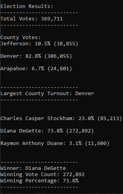

# PyPoll With Python
Analyzing election results via python

## Project Overview
A Colorado Board of Elections has requested a Python algorithm that can tabulate election results. The following capabilities were requested: 

1. Calculate the total number of votes cast. 
2. Get a complete list of candidates who received votes.
3. Calculate the total number of votes each candidate received. 
4. Calculate the percentage of votes each candidate won. 
5. Determine the winner of the election based on popular vote.  

In addition, the Board has requested that the algorithm be able to analyze the data by county. 

1. Calculate the voter turnout by county. 
2. Calculate the percentage of votes from each county out of the total count. 
3. Determine the county with the highest voter turnout. 

## Resources
- Data source: election_results.csv
- Software: Python 3.6.1, Visual Studio Code, 1.38.1

## Summary
### Voting Outcomes
The analysis of the election shows that: 
- There were 369,711 votes cast in the election. 
- The candidates were:
	- Charles Casper Stockham
	- Diana DeGette
	- Raymon Anthony Doane
- The candidate results were: 
	- Charles Casper Stockham received 23.0% of the vote and 85,213 votes. 
	- Diana DeGette received 73.8% of the vote and 272,892 votes. 
	- Raymon Anthony Doane received 3.1% of the vote and 11,606 votes. 
- The winner of the election was: 
	- Diana DeGette, who received 73.8% of the vote and 272,892 votes. 
### Algorithm's Terminal Output

## Challenge Overview

The purpose of this election audit was to write a Python algorithm that could efficentaly tabulate votes for a Colorado Board of Elections. 
Applications for tabulation include: calculating total number of votes cast, determining a complete list of candidates who received votes, calculating the votes received by each candidate, calculating the percentage of votes received by each candidate, and determining the winner of the election based on popular vote.  
The Colorado Board of Elections also requested that calculations be performed by county. This meant adding in a section to determine the voter turnout by county, the percentage of votes each county contributed to the total vote count, and the county with the highest turnout. 

## Election-Audit Summary
Since this algorithm can efficiently loop through data while tabulating vote counts for several different application simultaneously, it can be assumed that this algorithm could easily be expanded to other election formats.  
Because of the way the code is structured, it would not be difficult to expand it to a situation where multiple offices are up for election. Adding in an additional For Loop that tabulates votes for each seat would be simple. It would also be possible to nest another For Loop under that added bit of code to calculate the votes by county again for voter turnout.  
It would also be possible to expand this algorithm to tabulation of party primaries, as long as the .csv tracks which party the voter is voting under (ie: Democrat, Republican, Independent, etc.). You could create a list for each party, [party]_candidate_list and then create a loop that would only append candidate names to the [party]_candidate_list if the voter's party matches that of the list. After that, you could just re-utilize the code present in this algorithm to calculate the votes under each party list for their respective candidates and include county breakdown. 
